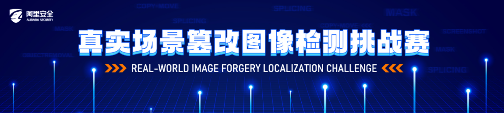

# Tamper_Detection_TC

The first time to join in Alibaba tianchi competition.

Because my major is not in tamper detection and I only have few days, the final grade is not good.However, I have learned a lot during these days.(219/1149)

The scheme adopted for this competition is only semantic segmentation.

The solution adopted for this competition was semantic segmentation. Two frameworks(segmentation_models_pytorch&catalyst) were used in this competition and a variety of semantic segmentation architectures were experimented and I got a more intuitive feel for semantic segmentation.

 segmentation models pytorch best model 链接：https://pan.baidu.com/s/1lD7hAKBUZjSgp10tpuc3kA?pwd=pqoj 
code：pqoj 
